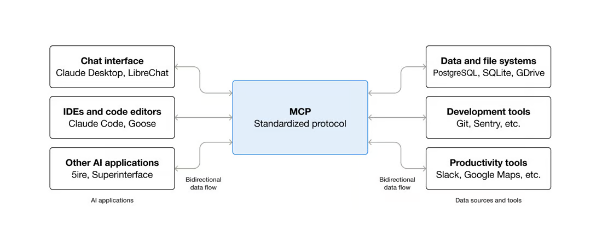

<!-- _class: lead -->
<!-- _paginate: false -->

# UAAA - Agentic Workshop

## For data analysis

Dimitrios S. Kanakoglou, Peter Wad Sackett, HALp
25 September 2026, DTU Health Tech

---

# Models and harnesses

The **model** generates text and proposes tool calls.
The **harness** runs the conversation and connects those calls to tools.

Today we are using **OpenCode**, a harness is incredibly modular. 

It reads your project, runs approved commands and
returns their results to the model so it can continue the task.

You can change the model while keeping the same harness and the same project.
The model server may be at DTU, but project commands run on your laptop.

<!-- Sources: https://opencode.ai/v2/docs/ and https://opencode.ai/v2/docs/providers/ -->

---

# Skills and agents

| | What you define | Example |
|---|---|---|
| **Skill** | Reusable instructions, with supporting scripts if needed | Download a PDB entry and check that it contains coordinates |
| **Agent** | A role, model and permissions, with instructions for doing its job | Review an analysis without editing its files |

OpenCode reads skills from `.opencode/skills/<name>/SKILL.md`
and agents from `.opencode/agents/<name>.md`.

An agent can load a relevant skill. A coordinator can delegate specific
jobs to other agents and combine their results.

<!-- Sources: https://opencode.ai/v2/docs/skills/ and https://opencode.ai/v2/docs/agents/ -->

---

# MCP (Model Context Protocol)



[OpenCode MCP server documentation](https://opencode.ai/v2/docs/mcp-servers/)

<!-- Diagram supplied by https://modelcontextprotocol.io/docs/2026-07-28/getting-started/intro. Examples illustrate the architecture, not a verified compatibility list. Configuration: https://opencode.ai/v2/docs/mcp-servers/ -->

---

# MCP servers and plugins

An **MCP server** exposes tools to the agent. 

For example, a local server lets the agent send SQL queries to DuckDB.

A **plugin** extends OpenCode itself.

It can react to events or add behaviour, such as a notification when work finishes.

Enable only the MCP servers you need. Inspect plugins before installing
them: they execute code, and their API must match your OpenCode version.

<!-- Sources: https://opencode.ai/v2/docs/mcp-servers/ and https://opencode.ai/v2/docs/plugins/ -->

---

# Free, paid and DTU models

| Choice | What you need to know |
|---|---|
| **OpenCode free models** | No model payment for the current free offers. Availability and limits can change. Requests leave DTU. |
| **Paid models** | Connect a supported subscription or API account. Check what it includes and how usage is billed. |
| **Four DTU models** | Workshop-hosted GPT-OSS, Mistral and two Qwens. Shared GPU capacity and context limits apply. |

Choose a model with `/models`. 

A chat subscription does not necessarily include API access. 

We use public datasets throughout this workshop.

<!-- Sources: workshop README and opencode.json; https://opencode.ai/v2/docs/providers/ -->

---

# Three lessons before we start

1. **You are in charge of your data.** Check the provider and the
   permissions you approve. Use public data with external models.

2. **`/compact` is your friend.** Summarise a long conversation to make
   room. Keep important decisions in files because summaries lose detail.

3. **`/theme` helps you look cool in front of your PI.** Choose a theme
   you enjoy working with. Try it before starting the exercises.

<!-- Lessons from the workshop README. Compaction: https://opencode.ai/v2/docs/compaction/ -->

---

# HALp: the workshop helper

<pre style="position:absolute;right:64px;top:40px;font-size:22px;line-height:1.15;background:none;border:0;padding:0;"> [o_o]  &lt;{ let's look }
 /|_|\
  / \</pre>

Start a **fresh chat**, then type `/halp` and your question:

```text
/halp I am on Exercise 1c. Where should I copy my skill?
/halp Why can I not see the workshop agents?
```

HALp reads the exercise instructions and offers hints or setup help.
It can help with context settings, with your approval. It should leave
the exercise answers to you.

HALp initially uses a **free external model**. Share only public information
and redacted errors. Afterwards, select your trusted agent and try again.

If HALp can't help you with your exercises, I don't think we can :D

---

# Exercise 1: skills

The first exercises introduces skills. Agent skills are portable, 
modular packages of instructions, scripts, and/or resources 
that provide AI agents with specialized capabilities and domain expertise.

Open `exercises/01-skills/README.md` and follow 
up to the point you feel you can do better.

---

# Exercise 2a–2b: agents

An AI agent is a software system that uses a large language model (LLM) 
as its central brain to autonomously perceive its environment, make decisions, 
and execute multi-step actions to achieve a specific goal.

It can use skills, mcps and tools.

Have fun with the swarm!

---

# Exercise 3: MCPs and data analysis

MCP stands for Model Context Protocol. 
Originally open-sourced by Anthropic, it has quickly been adopted 
across the industry (by OpenAI, Google DeepMind, and others) as an 
open standard. Think of MCP as the USB-C port for AI applications.

---

# Exercise 4: sharing
and 
# Bonus: plugins and debugging
